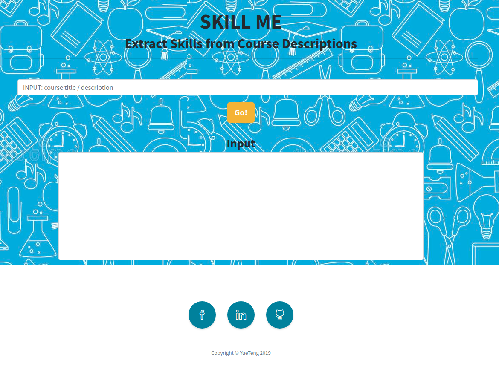
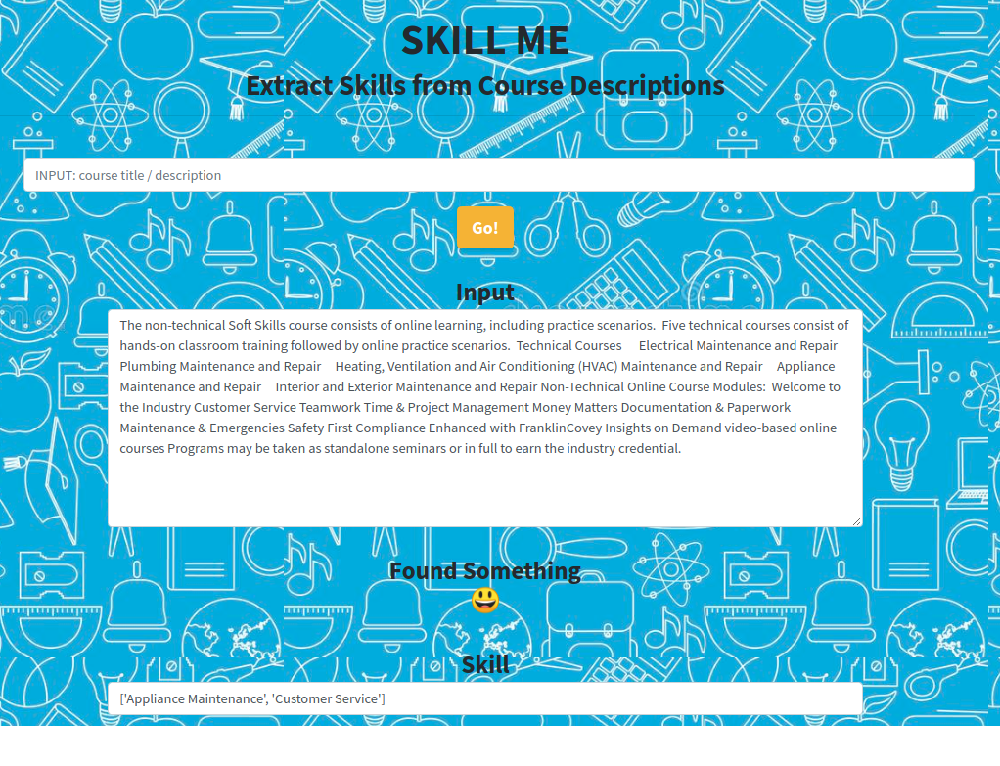
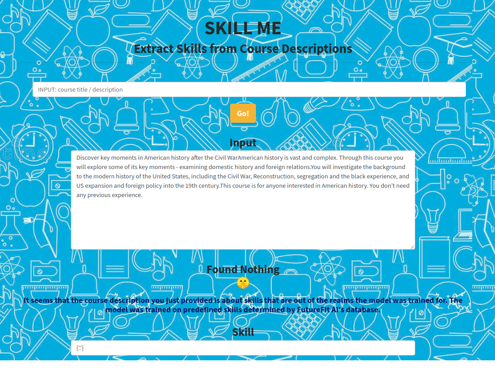

# Skill Me - Extract skills from course descriptions
Skill Me is a web app that extracts key job skills from text of course titles or descriptions. 

You can view the slides I made that describe the project here : [SkillMe Demo](https://github.com/mollyteng/insight/blob/master/SkillMe_Demo.pdf)

## Summary
Skill Me is a web app that uses Named Entity Recognizion (NER) in NLP to identify predifined key job skills from text of course titles or descriptions.

[SkillMe Development](https://github.com/mollyteng/insight/tree/master/skill_me) contains the development steps of SkillMe.

[SkillMe Application](https://github.com/mollyteng/insight/tree/master/webapp) contains the source code for the web app.

## Context and Use Case
Survey shows that 40% of employers can not find the talents with the right skills they need, while for individuals, it is hard to find personalized career and learning pathways to achieve their goals. It would be great if we can build an AI-powered platform that matches people, business and learning resources. As a first step, I developped SKill Me, an NLP-based model that automates the process of extracting job skills from various sources of texts.

This is a consulting project I worked on with FutureFit AI as an Insight Data Science Fellow.

## Data
I got the 3164 courses with titles and descriptions from FutureFit AI's database in semi-structured json format, among which 853 were labeled with skill tags.  
 
I used BeautifulSoup, nltk, and string libraries to clean the data. I kept texts in English only, lower-cased the words, and removed HTML tags.

Among the labeled courses, there were 224 unique skill tags.

## Training NER
I trained a new NER called "job skills" using spaCy library by starting from an empty model. I passed the training instances to the model in two ways:

- For courses that had exact wording appearing in the text (title+description), I passed the skill tag directly to the model;
- For courses that didn't have exact wording appearing anywhere in the text (title+description), I used Gensim Textrank to generate keywords and trained the model on the keywords and then mapped the keywords to the skill tags.

## Validation
I calculated semantic distance between the extracted job skills by the model and the true skill tags using pretrained Word2Vec embeddings and cosine similarity.

- Training mean cosine similarity: .90
- Test mean cosine similarity: .73

## Web Application
I built a web application to demonstrate the model using Python and Flask. It was deployed on Google Cloud Platform, accessiable at https://skillfinder.appspot.com/

Here are example results of the web app:

